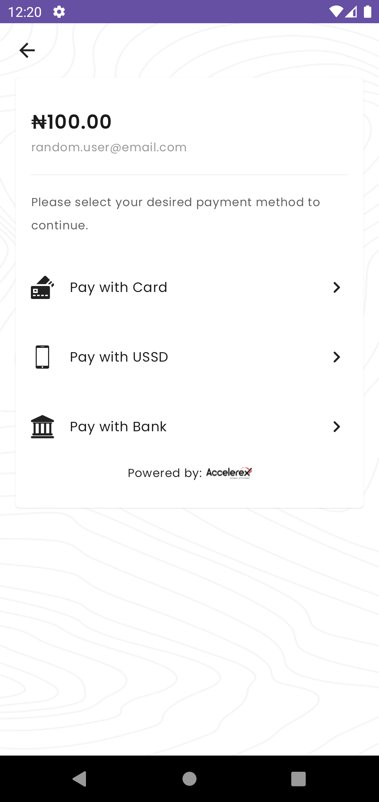
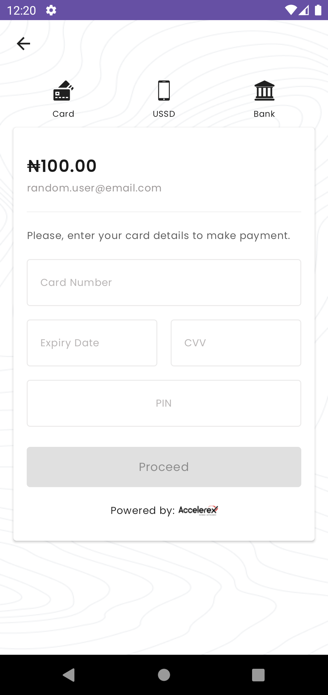
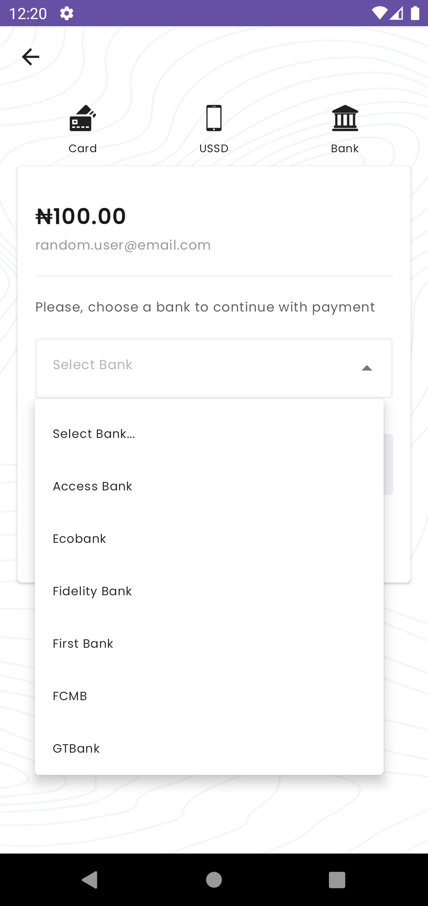
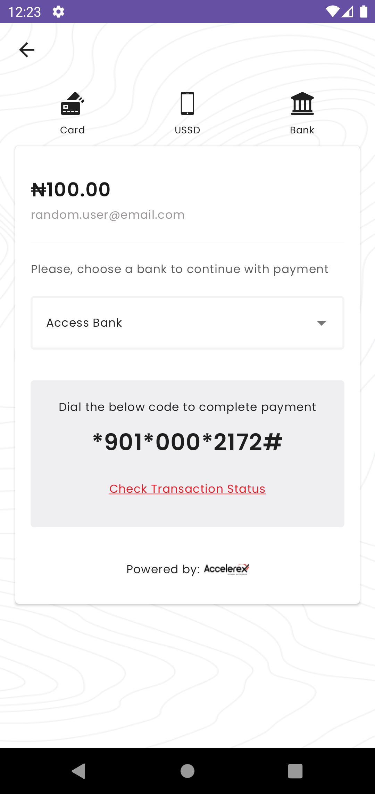
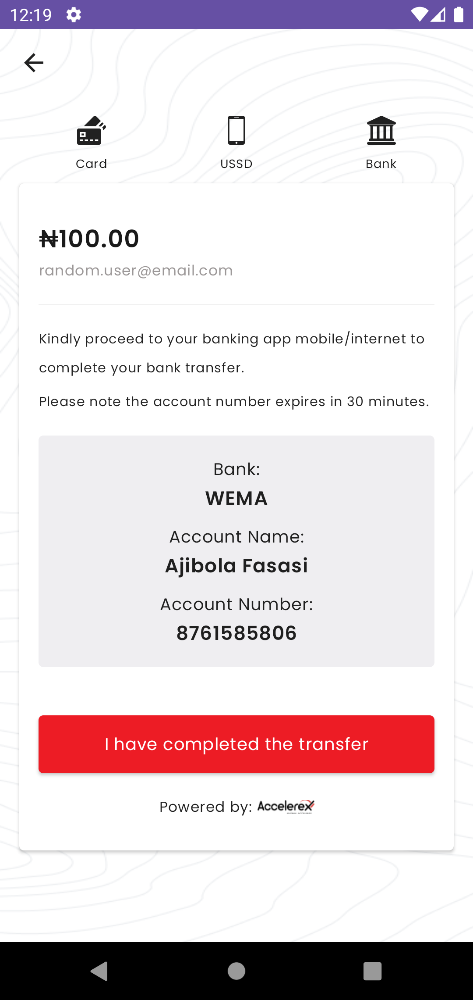

# :credit_card: Rexpay Plugin for Android



Android SDK to process RexPay payment.

## :rocket: Installation

More information will be out soon on this.

## :rocket: Initializing the SDK

Create your config class.
The config object can be created in the three following ways:

1. Supplying the Encryption keys from a FileInputStream.

```kotlin
val config = ConfigProp.Builder()
    .apiUsername("Authorization Username")
    .apiPassword("Authorization Password")
    .isTest(true)
    .clientPGPPrivateKey(assets.open("client secret key FileInputStream"))
    .clientPGPPublicKey(assets.open("client public key FileInputStream"))
    .rexPayPGPPublicKey(assets.open("RexPay public key FileInputStream"))
    .passphrase("Encryption Passphrase")
    .build()
```

2. Supplying the Encryption keys as a string value.

```kotlin
val config = ConfigProp.Builder()
    .apiUsername("Authorization Username")
    .apiPassword("Authorization Password")
    .isTest(true)
    .clientPGPPrivateKey("client secret key string")
    .clientPGPPublicKey("client public key string")
    .rexPayPGPPublicKey("RexPay public key string")
    .passphrase("Encryption Passphrase")
    .build()
```

3. Supplying the Encryption keys as a File.

```kotlin
val config = ConfigProp.Builder()
    .apiUsername("Authorization Username")
    .apiPassword("Authorization Password")
    .isTest(true)
    .clientPGPPrivateKey(File("client secret key file path"))
    .clientPGPPublicKey(File("client public key file path"))
    .rexPayPGPPublicKey(File("RexPay public key file path"))
    .passphrase("Encryption Passphrase")
    .build()
```

Call the `RexPay.init(config)` static method, passing context and the config object created,
to initialize the SDK.
No other configuration required&mdash;The SDK works out of the box.

## :heavy_dollar_sign: Making Payments

To make payment, You initialize a charge object with the necessary parameters.

```kotlin
val charge = Charge(
    amount = 100,
    currency = "NGN",
    userId = "random.user@email.com",
    callbackUrl = "",
    email = "random.user@email.com",
    customerName = "Random User"
)
```

Get an instance of RexPay by calling `val rexPay = RexPay.getInstance()`.

Call `rexPay.setPaymentListener` to listen to the result of the transaction.

```kotlin
rexPay.setPaymentListener(object : RexPay.RexPayListener {
    override fun onResult(result: PayResult?) {
        when (result) {
            is PayResult.Error -> TODO()
            is PayResult.Success -> TODO()
            null -> TODO()
        }
    }
})
```

Then call `rexPay.makePayment(this@MainActivity, charge)` to proceed with the payment.
<p>
    
    
</p>
<p>
    
    
</p>
